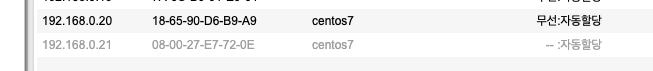
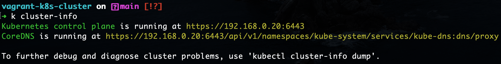

# vagrant-k8s-cluster-bootstrap
>Kubernetes 공식 문서를 기반으로 진행하였으며, 진행중 겪은 에러를 기반으로 동일한 에러를 다시 겪지 않도록 설정 내용을 수정하며 작성하였습니다.

Vagrant를 사용해 Kubernetes의 노드를 생성하고, kubeadm을 사용해 Kubernetes Cluster((v1.23.5)를 Bootstrap 하는 Hands-On Tutorial 입니다.

## Goal
Kubernetes v1.23.5 bootstraping by vagrant and kubeadm
## Environment
1. Host Spec
    - MacBook Pro (Retina 13-inch, Early 2015)
    - macOS Catalina v10.15.7
    - Processor: 2.7 GHz Dual Core Intel Core i5
    - 8GB RAM, 256GB Storage
2. Node Spec
    - Node Networking:
        - VBOX Bridge Mode
            - Host PC의 네트워크 장치와 bridge 모드 구성 (마치 호스트 머신처럼 wifi 공유기의 DHCP 서버에서 사설 IP를 할당받습니다.)
                
    - Master Node(ControlPlane): 
        - centos 7.9.2009 (core) (generic/centos 7) 
        - Kernel: Linux 3.10.0-1160.59.1.el7.x86_64
        - 2 CPU, 3096 Mem, 30GB Storage
    - Worker Node: 
        - centos 7.9.2009 (core) (generic/centos 7) 
        - Kernel: Linux 3.10.0-1160.59.1.el7.x86_64
        - 2 CPU, 2048 Mem, 30GB Storage
## Prerequire Tools
- vscode (+k8s plugin
- kubectl (v1.23.5)
- vagrant (v2.2.19), virtualbox (v6.1.32)
## Steps
### 1. 클러스터 노드 생성
1. Vagrantfile

    > master, worker 각 1대씩 bridge Network 모드로 생성합니다.

    ```vagrant
    vagrant.configure("2") do |config|
    config.vm.define "master" do |master|
        master.vm.box = "generic/centos7"
        master.vm.box_version = "3.6.10" # centos 7.9 based
        master.vm.network "public_network", :bridge => 'en0'
        master.vm.provider :virtualbox do |vb|   
        vb.cpus = 2
        vb.memory = 3096
        end
    end

    config.vm.define "worker" do |worker|
        worker.vm.box = "generic/centos7"
        worker.vm.box_version = "3.6.10" # centos 7.9 based
        worker.vm.network "public_network", :bridge => 'en0'
        worker.vm.provider :virtualbox do |vb|   
        vb.cpus = 2
        vb.memory = 2048
        end
    end
    end
    ```
2. 노드 생성
    ```
    vagrant up
    ```

### 2. 클러스터 설치

>**[All Node (Master, Worker)]**
1. hostname 변경

    각 노드는 hostname이 고유해야 합니다. 저는 worker 노드의 hostname만 변경 하였습니다.

2. Off SELinux
    
    kubeadm은 아직 selinux환경을 지원하지 않고 있습니다. 자세하게는 container가 pod의 Network에 도달해야 하기 위해서는 selinux off가 필요합니다.

    - selinux off

        ```
        sudo setenforce 0
        sudo sed -i 's/^SELINUX=enforcing$/SELINUX=permissive/' /etc/selinux/config
        ```
    - 확인

        ```
        sudo getenforce
        ```

3. Off Swap
    
    kubelet이 제대로 동작하기 위해선 반드시 swap을 사용하지 않아야 합니다.
    - swapoff - runtime
        ```
        sudo swapoff -a
        ```
    - swapoff - fstab 
        
        >sudo vi /etc/fstab
        ```
        # /dev/mapper/centos_centos7-swap swap                    swap    defaults        0 0
        ```
4. Off Firewalld
    
    방화벽에서 필수 포트만 개별적으로 개방해도 되지만, 본 환경은 테스트 목적으로 OS수준의 방화벽을 내립니다.
    ```
    sudo systemctl stop frewalld
    sudo systemctl disable firewalld
    ```

5. Setup iptables config
    
    NetworkPlugin의 요구사항으로 NetworkPlugin이 올바르게 동작하기 위한 설정입니다, kube-proxy는 리눅스의 iptables 기반으로, 클러스터에 구성된 브릿지 트래픽은 iptables에 의해 올바르게 처리되어야 하기 위해 설정해 줍니다.

    즉, NetworkPlugin은 net/bridge/bridge-nf-call-iptables sysctl을 1 로 설정하여 iptables 프록시가 올바르게 작동하는지 확인할 수 있습니다.

    - br_netfilter 모듈 로드 및 sysctl 구성에서 net.bridge.bridge-nf-call-iptables를 1로 설정

        ```bash

        cat <<EOF | sudo tee /etc/modules-load.d/k8s.conf
        br_netfilter
        EOF

        sudo modprobe br_netfilter

        cat <<EOF | sudo tee /etc/sysctl.d/k8s.conf
        net.bridge.bridge-nf-call-ip6tables = 1
        net.bridge.bridge-nf-call-iptables = 1
        EOF

        sudo sysctl --system
        ```
    - 설정 확인
        ```
        lsmod | grep br_netfilter
        cat /etc/sysctl.d/k8s.conf | grep net.bridge.bridge-nf-call-ip6tables
        cat /etc/sysctl.d/k8s.conf | grep net.bridge.bridge-nf-call-iptables
        ```
6. Install Container Runtime
    
    쿠버네티스는 파드가 노드에서 실핼될 수 있도록 클러스터 각 노드에 컨테이너 런타임을 설치해야 합니다. 파드는 설치된 컨테이너 런타임을 사용해 컨테이너를 실행 합니다.
    
    쿠버네티스는 CRI(kubelet이 Container와 통신하기 위해 사용하는 API로 이해할 수 있습니다)를 사용하여 사용자가 선택한 컨테이너 런타임과 상호작용 하기 때문에, 쿠버네티스의 CRI 요구사항을 만족하는 컨테이너 런타임을 사용해야 합니다.

    - Install Docker Runtime
        ```
        sudo yum install -y yum-utils

        sudo yum-config-manager \
        --add-repo \
        https://download.docker.com/linux/centos/docker-ce.repo

        sudo yum install docker-ce docker-ce-cli containerd.io

        sudo systemctl enable --now docker
        ```
    - After Installation
        ```
        sudo usermod -aG docker $USER # docker group에 사용자 추가
        newgrp docker # 변경된 group 정책 즉시 활성화
        ```

7. cgroup 드라이버 설정
    
    Continaer Runtime과 kubelet의 cgroup 드라이버를 일치시켜야 합니다.
    
    기본적으로 kubelet은 systemd 드라이버를 사용하므로, docker cgroup driver를 cgroupfs(기본값)에서 systemd로 변경해야 합니다. (CNCF에서는 cgroupfs보다 systemd드라이버를 권장합니다)
    - docker cgroup driver 확인 (기본값으로 cgroupfs가 설정된걸 확인할 수 있습니다)
        ```
        docker info |grep -i cgroup
        ```
    - docker cgroup driver 변경 (cgroupfs -> systemd)
        
        ExecStart 라인 맨 우측에 "--exec-opt native.cgroupdriver=systemd" 옵션 추가
        
        >sudo vi /usr/lib/systemd/system/docker.service
        ```
        ExecStart=/usr/bin/dockerd -H fd:// --containerd=/run/containerd/containerd.sock --exec-opt native.cgroupdriver=systemd
        ```
    - daemon reload & docker restart    
        ```
        sudo systemctl daemon-reload
        sudo systemctl restart docker
        ```

8. kubeadm, kubelet, kubectl 설치
    
    - kubeadm: 클러스터를 부트스트랩 하는 명령 바이너리 (부트스트랩이란 아무것도 없는 환경에서 시작한다는 뜻)
    
    - kubelet: 클러스터의 모든 머신에서 실행되며 파드와 컨테이너의 시작과 같은 작업을 수행하는 컴포넌트, kubelet은 kubernetes api 버전보다 낮아야 호환이 가능하며, 그 반대의 경우는 호환되지 않습니다.
    
    - kubectl: 클러스터와 통신하기 위한 커맨드라인 유틸리티

    1. yum repo 등록
        ```
        cat <<EOF | sudo tee /etc/yum.repos.d/kubernetes.repo
        [kubernetes]
        name=Kubernetes
        baseurl=https://packages.cloud.google.com/yum/repos/kubernetes-el7-\$basearch
        enabled=1
        gpgcheck=1
        repo_gpgcheck=0
        gpgkey=https://packages.cloud.google.com/yum/doc/yum-key.gpg https://packages.cloud.google.com/yum/doc/rpm-package-key.gpg
        exclude=kubelet kubeadm kubectl
        EOF
        ```
         > ***Error Case) repomd.xml signature 에러**
         >- repo_gpgcheck=1 로 설정할 경우 아래와 같은 Error를 만날수도 있습니다.
         > 해당 에러는 centos7의 잘 알려진 에러로서 kubernetes repo config인 /etc/yum.repos.d/kubernetes.repo 에서 repo-gpgcheck=0으로 세팅하여 해결할 수 있습니다. <br>
            ```
            failure: repodata/repomd.xml from kubernetes: [Errno 256] No more mirrors to try.
            https://packages.cloud.google.com/yum/repos/kubernetes-el7-x86_64/repodata/repomd.xml: [Errno -1] repomd.xml signature could not be verified for kubernetes
            ```
    2. 패키지 설치 및 kubelet 활성
        > kubelet 활성 이후 "systemctl status kubelet으로 화인시 status가 failure인 이유는 아직 kubeadm으로 클러스터를 bootstrap 하기 전 이므로 kubelet의 status는 비정상으로 확인되며 이는 정상입니다.
        ```
        sudo yum install -y kubelet kubeadm kubectl --disableexcludes=kubernetes
        sudo systemctl enable --now kubelet
        ```

>**[Master Node]**

1. Bootstrap Control Plane
    ```
    sudo kubeadm init --apiserver-advertise-address=<ip-address> --pod-network-cidr=<ip-address> --kubernetes-version=<kubernets-version>
    ```
    - "--pod-network-cidr" 은 클러스터에 사용될 네트워크 플러그인이 사용합니다. 각 NetworkPlugin마다 주로 사용하는 주소대역이 있지만, 클러스터에서 이미 해당 주소대역을 사용할 경우 다른 주소대역을 사용합니다. (여기서는 calico를 설치할 예정으로 192.168.0.0/16 대역을 사용했습니다.)
        - 현재 pod cidr 확인: 
            ```
            kubectl cluster-info dump | grep -m 1 cluster-cidr
            ```

    - "--service-cidr" 은 쿠버네티스 서비스들의 주소대역을 설정합니다. 생략할 경우 기본값으로 "10.96.0.0/12" 대역이 할당됩니다.

    - "--apiserver-advertise-address"는 마스터가 1대일때 노출할 API서버의 Endpoint로 마스터 노드의 사설 ip 를 입력합니다.

    - "--control-plane-endpoint" 는 master node가 여러대 이고, 앞단에 Proxy를 통한 HA를 구성했을때 사용합니다.

    - "--kubernetes-version" 은 쿠버네티스 버전을 특정하여 설치할 경우 사용합니다. 생략할 경우 디폴트 값으로 stable버전의 -1 한 버전이 설치됩니다. 여기서는 1.23.5 버전을 사용했습니다.
   
        > 자세한 Option 및 kubeadm init workflow는 아래 링크에서 확인할 수 있습니다.
        https://kubernetes.io/docs/reference/setup-tools/kubeadm/kubeadm-init/#init-workflow

    - 출력
        > 제 환경에서 생성된 토큰 값을 가리기 위해 값을 TOKEN_VALUE, TOKEN_HASH_VALUE 로 치환해두었습니다.
        ```
        Your Kubernetes control-plane has initialized successfully!

        To start using your cluster, you need to run the following as a regular user:

        mkdir -p $HOME/.kube
        sudo cp -i /etc/kubernetes/admin.conf $HOME/.kube/config
        sudo chown $(id -u):$(id -g) $HOME/.kube/config

        Alternatively, if you are the root user, you can run:

        export KUBECONFIG=/etc/kubernetes/admin.conf

        You should now deploy a pod network to the cluster.
        Run "kubectl apply -f [podnetwork].yaml" with one of the options listed at:
        https://kubernetes.io/docs/concepts/cluster-administration/addons/

        You can now join any number of control-plane nodes by copying certificate authorities
        and service account keys on each node and then running the following as root:

        kubeadm join 192.168.0.20:6443 --token <TOKEN_VALUE> \
                --discovery-token-ca-cert-hash <TOKEN_HASH_VALUE> \
                --control-plane 

        Then you can join any number of worker nodes by running the following on each as root:

        kubeadm join 192.168.0.20:6443 --token <TOKEN_VALUE> \
                --discovery-token-ca-cert-hash <TOKEN_HASH_VALUE> 
        ```
2. kubernetes의 config(kubeconfig)을 사용 설정

    kubeadm을 사용하여 클러스터 설치 시 기본적으로 admin.conf가 생성되고 이를 통해 쿠버네티스 api서버와 통신하게 됩니다.
    
    아래 작업은 해당 conifg을 비 루트 유저(본 가이드에선 현재 작업중인 리눅스 사용자 ex: vagrant)도 사용할 수 있도록 설정하는 작업입니다.
    
    해당 파일을 마스터 노드 뿐 아니라 원격 환경으로 가져와서 원격 환경에서 클러스터 API와 통신할 수도 있습니다.
    
    다만, 주의해야 할 점은 해당 config은 admin 권한으로 클러스터에 대한 모든 권한을 행사할 수 있기 때문에 별도의 user를 생성하고 그에 알맞는 권한이 부여된 config을 새로 생성하여 사용하는것이 안전합니다.
    
    관련 명령어로 "kubeadm kubeconfig user"을 통해 config을 생성할 수 있습니다.
     
    ```
    mkdir -p $HOME/.kube
    sudo cp -i /etc/kubernetes/admin.conf $HOME/.kube/config
    sudo chown $(id -u):$(id -g) $HOME/.kube/config
    ```
    
    - [OPTION] kubeconfig 파일을 Host PC 로 복사하여 Host PC에서 클러스터를 관리
        
        vagrant로 가상머신을 생성했기에, vagrant-scp 플러그인을 통해 Master 노드에 있는 kubeconfig을 호스트 머신으로 copy 합니다. vagrant가 아닐경우, 일반적인 scp를 사용해서 파일을 로컬 환경으로 복사 할 수 있습니다.
        - 설치
            ```
            vagrant plugin install vagrant-scp
            ```
        - 파일 복사 (vagrant scp src dest)
            ```
            vagrant scp master:/home/vagrant/.kube/config ~/.kube/
            ```
    - kubectl 정상 동작 확인
        
        kubectl 클라이언트 도구를 사용해 kubeconfig이 정상적으로 세팅되었는지, 그리고 현재 노드의 상태, System Pod의 상태도 확인해 봅니다.
        
        아직 networkplugin이 설치되지 않았으므로 nodessms NotReady 상태로 확인 되며, 또한 coreDNS 도 NetworkPlugin이 없어 Pending으로 확인 됩니다.
        ```
        kubectl config current-context
        kubectl config view
        kubectl get nodes
        kubectl get pod -n kube-system
        ```

3. Network Plugin (CNI) 설치
    
    클러스터의 모든 Pod가 상호 통신할 수 있도록 하는 NetworkPlugin을 설치합니다, 네트워크 플러그인이 없다면, pod는 다른 노드의 pod와 통신 하지 못합니다. 따라서 calico와 같은 NetworkPlugin을 별도로 설치해야 합니다.
    - calico CNI 설치
        ```
        curl https://projectcalico.docs.tigera.io/manifests/calico.yaml -O
        kubectl apply -f calico.yaml    
        ```
    - 설치 후
    
        kube-system 네임스페이스에서 calico 파드가 정상적으로 Running이 될 경우, coredns pod도 pending에서 running이 되며, node의 상태 또한 Ready상태가 됩니다.
        
        >after calico installation - pod status
        
        
            
        >after calico installation - node status
        
        

4. [OPTION] 만약 개발환경에서 노드 1대로 운영하고자 한다면, 마스터노드에 시스템 파드 외에 모든 파드가 스케쥴링 가능하도록 taint를 해주면 됩니다.
    ```
    kubectl taint nodes --all node-role.kubernetes.io/master-
    ```

>**[worker node]**
    
- ControlPlane이 정상적으로 Boostrap 된 후 Worker 노드를 세팅하여 클러스터에 합류시킵니다.
- kubeadm은 관리자 권한이 필요하므로, "sudo su -" 커맨드를 통해 작업할 사용자를 root 로 변경하거나 커맨드에 sudo를 붙혀 사용합니다.
- 마스터노드와 워커노드의 hostname은 동일해선 안됩니다.
- 현재 테스트 환경에선 워커노드 조인시 호스트네임을 DNS가 Resolve 하지 못하기 때문에, 조인 전 워커노드의 "/etc/hosts" 파일에 워커노드의 IP를 워커노드의 hostname과 맵핑 시켜 줍니다.

1. 앞서 모든 노드에서 해야되는 작업을 수행합니다. -> [All node]
2. worker node hostname을 DNS Resolve 하도록 구성
    > vi /etc/hosts
    ```
    <IPv4> <WORKER_NODE_HOSTNAME>
    ```
3. 클러스터 Join

    앞서 kubeadm을 통해 마스터노드를 bootstrap 한 후 출력된 값을 사용하여 join 명령을 수행합니다. 해당 명령을 통해 노드가 클러스터의 worker 노드로 등록됩니다.
    ```
    sudo kubeadm join --token <token> <control-plane-host>:<control-plane-port> --discovery-token-ca-cert-hash sha256:<hash>
    ```
- 출력
    ```
    This node has joined the cluster:
    * Certificate signing request was sent to apiserver and a response was received.
    * The Kubelet was informed of the new secure connection details.

    Run 'kubectl get nodes' on the control-plane to see this node join the cluster
    ```
- 현재 kubeconfig을 사용할 수 있는 환경(Master 노드 혹은 Host PC, 또는 현재 클러스터의 kubeconfig을 통해 kubectl을 사용할 수 있는 환경)에서 join된 worker 노드를 확인합니다.
    

> 이제 Master 1대와 Worker 1대를 가진 k8s cluster의 Bootstrap을 모두 마쳤습니다.
## Result
1. 클러스터 상태
    - node 상태
        
    - pod 상태
        
    - cluster info
        
1. 마스터 노드
    - "/etc/kuberentes" File lsit
        
    - kubelet status
         
2. 워커 노드
    - "/etc/kubernetes" file list
        
    - kubelet status
        

## Clean Up
클러스터와 가상머신을 삭제합니다.

1. 클러스터 제거
    
    Worker노드 부터 진햅합니다. Worker노드는 3번까지 진행하여 제거하고, Master노드는 1번의 kubeadm reset시 클러스터에서 제거됩니다. root 권한으로 진행합니다. (sudo su -)
    1. node reset
        ```
        kubectl drain <node name> --delete-emptydir-data --force --ignore-daemonsets

        kubeadm reset
        ```
    2. [OPTION] iptables reset
        ```
        iptables -F && iptables -t nat -F && iptables -t mangle -F && iptables -X

        ipvsadm -C
        ```
    3. worker 노드는 위 내용을 수행한 뒤 아래 커맨드로 노드를 제거합니다.
        ```
        kubectl delete node <node_name>
        ```
2. 가상머신 제거
    
    Vagrant로 생성한 VBOX 가상머신을 제거합니다.
    ```
    vagrant halt # 가상머신 종료

    vagrant destroy # 가상머신 삭제
    ```
## Ref.
- [Kubernetes Docs](https://kubernetes.io/docs/setup/production-environment/tools/kubeadm/install-kubeadm/)
- [Calico Docs](https://projectcalico.docs.tigera.io/getting-started/kubernetes/self-managed-onprem/onpremises)
- [Vagrant Tutorial by 44bits](https://www.44bits.io/ko/post/vagrant-tutorial)